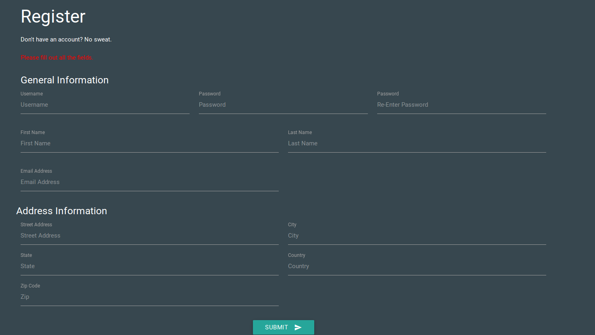
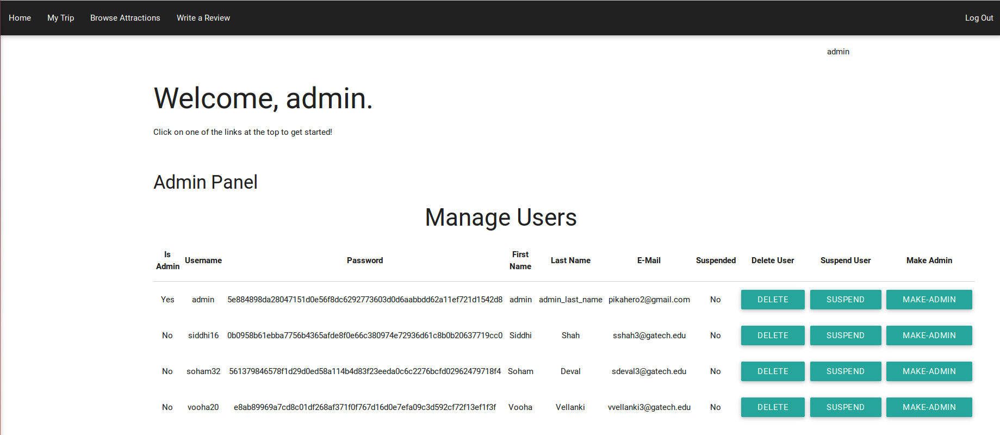
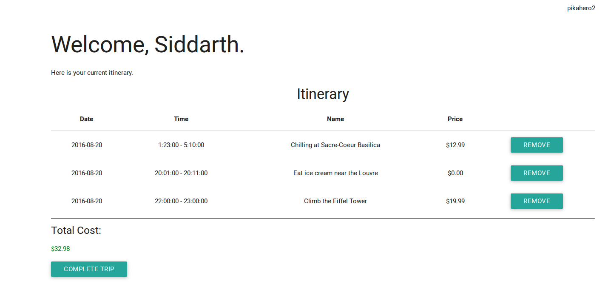

# Travel-Planner

A web application that allows users to create travel itineraries for their vacations.

## To run application:
1. Open up terminal and change directory (cd) until your current working directory is the directory containing "run.py".
2. Type `python run.py` and hit enter.
3. Open up any web browser on the same machine and go to the address `localhost:5000`.

### Note:
To use the database functionality, before you run the application for the first time, you will need to do the following.

1. Type `mysql -u root -p < team1-schema.sql` into your terminal and hit enter.
2. Enter your mysql password.
3. Type `mysql -u root -p < team1-data.sql` into your terminal and hit enter.
4. Enter your mysql password.
5. In the file "run.py", at the bottom, replace the default database password with your own MySQL password.

## Functionality
Here is a list of the various pages available for users on the website with details of the activities that users can perform.

### Home Page
* Click on the login/register button from the home page to create an account.

### Login/Registration Page

* You may register a new account by entering all the form data under the "register" section and clicking submit.
* You may login under the login section by entering your username and password and clicking submit.
* Your password will be hashed and stored as a hash in the database.
* If you want to have some fun, try typing `' OR '1'='1' --` for your username and leave your password blank when you login :)

### Home Page
* If you are admin (the admin account password is "password"), the home page will have controls for managing users and attractions. Note: creating and updating attractions in the admin panel is still a work in progress.
* You can also create a new trip from this page.

### Trip Page
* From here you can view your itinerary of planned activities and, if you wish to, complete your trip.
* To complete a trip, you need to enter your credit card information if and only if the sum of your activity costs is greater than $0.00 and if your credit card information hasn't been stored by the database before.

### Attractions Page
* The attractions page lists all the available attractions for you to visit. You can view the hours of operation by clicking on the "Hours" buttons on the left side of the page next to the attraction information, and you can view reservation slots by clicking on "Time Slots" on the right side of the page.
* For any attraction you decide to add to your trip, you must specify an activity to perform there, the start/end times, date, and cost.

### Write Reviews
* From this page, you can write reviews for attractions you have visited in the past.
* You can view reviews you and others have written from the Attractions page.
